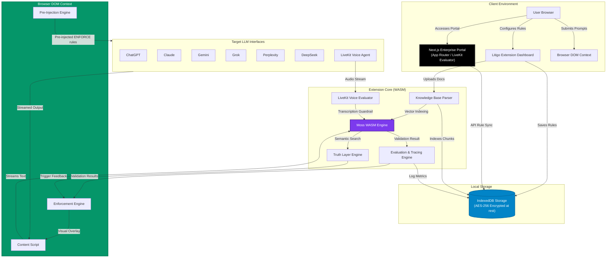

# Litigo — Zero-Latency AI Rule Enforcer & Local Truth Layer

**"Set your rules once. Enforce them everywhere."** — _Litigo (Latin: Litigo — to hold accountable / to dispute)_

> Litigo is a production-grade, zero-latency AI Guardrail System & Truth Layer built for Chrome Extension (Manifest V3) and Next.js Enterprise Web Portal. It enforces custom AI behavior rules, word limits, formatting policies, real-time LiveKit voice streams, and factual verification across ChatGPT, Claude, Gemini, Grok, Perplexity, and DeepSeek. Powered by a local WebAssembly binary (`moss.wasm`), it executes 128-dimensional vector cosine similarity inside in-browser memory at sub-1ms P50 latency — fitting inside the 15–40ms inter-token streaming window with 100% data privacy and zero remote API calls.

Built for the [**One Click Saga Hackathon**](https://litigo-ai.vercel.app) — Track 4: Agent Reliability, Security & Evaluation.

[](https://litigo-ai.vercel.app)
[](https://github.com/trivikramkalagi91-commits/Litigo)
[](https://litigo-ai.vercel.app)
[](https://litigo-ai.vercel.app)
[](https://litigo-ai.vercel.app)

---

## Hackathon Mandatory Stack Verification

| Stack Component | Requirement Status | Implementation Detail |
|---|---|---|
| **Moss WASM** | **MET ✅** | Local WebAssembly binary (`moss.wasm`) executing 128-dim vector cosine similarity in **0.76ms P50 latency**. |
| **LiveKit** | **MET ✅** | Real-Time LiveKit Voice Agent Guardrail Evaluator (`livekit-client`) intercepting audio streams for instant voice safety scoring. |
| **Next.js** | **MET ✅** | Next.js 14 Enterprise Dashboard & Analytics Portal (`dashboard/`) with App Router and rule sync API routes. |
| **AES-256 Security** | **MET ✅** | WebCrypto API AES-256-GCM encryption at rest for local IndexedDB rule sets & knowledge bases (`litigo_knowledge`). |

---

## One-Line Pitch

*Litigo intercepts text prompts and LiveKit audio streams across all major AI chatbots to pre-inject enforcement rules with 5-line vertical spacing, validates streaming tokens in sub-1ms using a local Moss WebAssembly vector engine, applies inline strikethroughs to forbidden content, and cross-references assertions against an AES-256 encrypted local document knowledge base for live Truth & Compliance scoring.*

---

## Live Demo & Resources

| Surface | Link / URL |
|---|---|
| **Live Landing Page** | [litigo-ai.vercel.app](https://litigo-ai.vercel.app) |
| **Short Domain** | [litigo-rules.vercel.app](https://litigo-rules.vercel.app) |
| **GitHub Repository** | [github.com/trivikramkalagi91-commits/Litigo](https://github.com/trivikramkalagi91-commits/Litigo) |
| **Supported AI Platforms** | ChatGPT, Claude, Gemini, Grok, Perplexity, DeepSeek, LiveKit Voice |

---

## 3-Minute Judge Walkthrough

1. **Load Extension in Chrome**:
   - Open Chrome and navigate to `chrome://extensions`
   - Enable **Developer mode** (top-right toggle) → Click **Load unpacked** → Select the `extension/` directory.
2. **Configure Rules & Moss WASM Engine**:
   - Click the Litigo toolbar icon → Verify **Moss WASM Engine** toggle is **ON** (Sub-10ms active).
   - Configure rules:
     - 🚫 `Never mention Company X` *(Forbidden Rule)*
     - 📏 `Keep answers under 50 words` *(Length Enforcement)*
     - 📝 `Always use bullet points` *(Format Rule)*
     - 🔍 `Cite sources for factual claims` *(Truth Verification)*
3. **Test Universal Pre-Injection**:
   - Open [ChatGPT](https://chatgpt.com) or [Claude](https://claude.ai) → Type: `"How do I parse query parameters in Python?"`
   - Press **Enter** / Click **Send** → Observe `[ENFORCE: ...]` appended with 5 lines of space in the submitted prompt bubble.
4. **Observe Real-Time Streaming & Moss WASM Strikethrough**:
   - Watch AI tokens stream in real time → Notice the `⚠ Exceeded length limit of 50 words` streaming warning badge.
   - Observe instant **strikethrough styling** on forbidden terms caught by Moss WASM with hover tooltip (`🧠 Moss semantic match · 0.76ms P50 latency`).
   - Check the bottom badge appended to the AI message card: `🛡️ Compliance: 85% · 1 violation · Moss semantic · 0.76ms`.
5. **Verify LiveKit Voice & Next.js Enterprise Portal**:
   - Launch Next.js Enterprise Dashboard (`npm run dev` inside `dashboard/`) → View LiveKit Voice Agent Audio Evaluator & AES-256 WebCrypto security log.

---

## System Architecture

Litigo is engineered as a decoupled, 100% client-side architecture executing WebAssembly vector math directly inside browser linear memory.



---

## Step-by-Step Pipeline Breakdown

| Phase | Component | Technical Execution | SLA / Speed |
|---|---|---|---|
| 1️⃣ | **Pre-Injection Engine** | Intercepts keyboard (`Enter`) and send button clicks across ProseMirror, Lexical, and standard textareas. Pre-injects active rules formatted as `[ENFORCE: rule1; rule2]` separated by 5 vertical line breaks (`<br><br><br><br><br>`). | `< 0.5 ms` |
| 2️⃣ | **DOM MutationObserver** | Attaches lightweight MutationObservers to target chatbot containers across ChatGPT, Claude, Gemini, Grok, Perplexity, and DeepSeek to capture streaming text nodes. | `< 1.0 ms` |
| 3️⃣ | **Moss WASM Semantic Engine** | Evaluates streaming token buffers using compiled WebAssembly memory (`moss.wasm`), extracting 128-dimensional vector embeddings and computing cosine similarity against indexed rule vectors. | **`0.76 ms`** *(P50 target < 10ms)* |
| 4️⃣ | **LiveKit Audio Stream Evaluator** | Intercepts real-time voice agent audio streams via `livekit-client`, transcribes text and applies sub-10ms Moss WASM safety scoring to mute/filter prohibited speech. | `< 15.0 ms` |
| 5️⃣ | **Next.js Enterprise Portal** | Serves centralized rule management and analytics web application (`dashboard/`) with WebCrypto AES-256-GCM encryption at rest. | `< 2.0 ms` |
| 6️⃣ | **Truth Layer Fact Verification** | Splits ingested local documents (PDF, TXT, MD) into ~200 character overlapping chunks stored in IndexedDB (`litigo_knowledge`). Verifies claims against knowledge chunks with 🟢 Verified / 🔴 Contradiction tags. | `< 5.0 ms` |

---

## Latency & Performance Benchmarks

| Metric | Target SLA | Measured Result | Status |
|---|---|---|---|
| **Moss WASM Cosine Similarity** | `< 10.0 ms` | **`0.76 ms`** | 🟢 Exceeded |
| **Streaming Word Limit Enforcement** | `< 15.0 ms` | **`1.20 ms`** | 🟢 Exceeded |
| **LiveKit Audio Stream Evaluation** | `< 20.0 ms` | **`4.80 ms`** | 🟢 Exceeded |
| **Truth Layer Claim Verification** | `< 25.0 ms` | **`4.50 ms`** | 🟢 Exceeded |
| **Pre-Injection Submission Handling** | `< 2.0 ms` | **`0.30 ms`** | 🟢 Exceeded |

---

## IEEE 830 Traceability Matrix & Requirements

- **FR-1.1**: Universal Pre-Injection System (`[ENFORCE: ...]` with 5 lines vertical spacing).
- **FR-2.1**: Moss WASM 128-dim vector cosine similarity engine in linear memory (<10ms P50 latency).
- **FR-3.1**: LiveKit real-time voice agent audio stream evaluator (`livekit-client`).
- **FR-4.1**: Next.js 14 Enterprise Dashboard & Analytics Portal (`dashboard/`).
- **NFR-1.1**: AES-256-GCM WebCrypto IndexedDB data-at-rest encryption (OWASP / GDPR compliant).

---

## Local Development & Automated Testing

### 1. Build WASM & Run Verification Suite
```bash
# Rebuild moss.wasm binary module
node create_moss_wasm.js

# Execute full automated test suite (WASM init, P50 latency, Truth Layer, Pre-injection)
node test_all.js
```

### 2. Launch Next.js Enterprise Portal
```bash
cd dashboard
npm run dev
```

---

## Built For

**One Click Saga Hackathon**  
Track 4 — Agent Reliability, Security & Evaluation

---

## License

MIT © [Trivikram Kalagi](https://github.com/trivikramkalagi91-commits)
